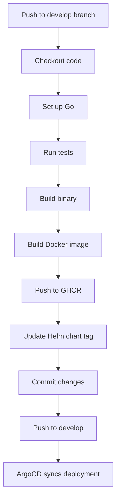

# kbot

A Telegram bot for experimenting with Golang and the [telebot](https://github.com/tucnak/telebot) library. Easily launched from the command line and ready for deployment in your environment.

- **Telegram Bot:** [t.me/mkhomytsia_bot](https://t.me/mkhomytsia_bot)
- **Implementation Language:** Go 1.22+

## Features

- Start the bot using the CLI command `kbot start`;
- Responds to the text `hello` with the current application version;
- Separate command `kbot version` to check the build version.

## CI/CD Pipeline

The project uses GitHub Actions for automated CI/CD. The workflow triggers on pushes to the `develop` branch and performs the following steps:



## Prerequisites

- [Go 1.22 or newer](https://go.dev/dl/) installed;
- Telegram account (to obtain a token from [@BotFather](https://t.me/botfather));
- Environment variable `TELE_TOKEN` set with your bot token.

## Installation

```bash
git clone https://github.com/mkhomytsya/kbot.git
cd kbot
go mod download
```

## Usage

1. Set your token:
   ```bash
   read -s TELE_TOKEN
   paste your token into the console and press Enter
   export TELE_TOKEN
   ```
2. Build the executable:
    ```bash
    go build -ldflags "-X=github.com/mkhomytsya/kbot/cmd.appVersion=v1.0.2"
    ./kbot version
    ./kbot start
    ```

## Example Interaction in Telegram

Send `/start hello` to the bot, and it will reply: `Hello I'm Kbot Version 1.0.2!`.

## Additional Information

This project uses the `gopkg.in/telebot.v3` library to interact with the Telegram API. If you change the bot’s behavior or add new commands, update the token and restart the service.

rebuild